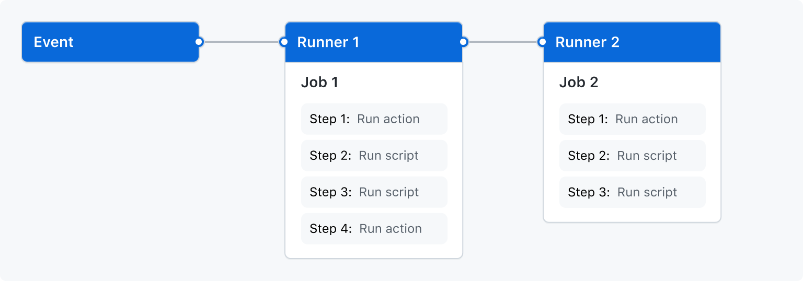

# Introduction

## What is CI/CD

Integration & Delivery

$$
    \framebox{Devlopment} \rightarrow \framebox{Test} \rightarrow \framebox{Deployment}
$$

- CI: Continuous Integration
- CD: Continuous Delivery

\pause

**Continuous**: make above steps interwoven, rather than in batches.

For this, we need **automation**.

## GitHub Actions overview

\columnsbegin
\column{.5\textwidth}
\footnotesize

```yaml
name: learn-github-actions
on: push
jobs:
  check-bats-version:
    runs-on: ubuntu-latest
    steps:
      - uses: actions/checkout@v3
      - uses: actions/setup-node@v3
        with:
          node-version: '14'
      - run: npm install -g bats
      - run: bats -v
```

\normalsize
\column{.5\textwidth}

Setup hierarchy:

- **Workflow**: a configuration file
- **Job**: a set of *steps* that can execute in parallel
- **Step**: an *action* or a script
- **Action**: a configurable and reusable script (c.f. a function)

\columnsend

## GitHub Actions overview (Cont.)



\extrafootnote{https://docs.github.com/en/actions/learn-github-actions/understanding-github-actions}

## Advantages of GitHub Actions

- Cost
  - Free hosted runners for **public** repository
  - Free self-hosted runners for **private** repository
  - c.f. Buildkite: per user charge

\pause

> - Integration with GitHub
>   - No need for additional access to the repository
>   - No need for additional access to the runner
>   - No need for CI access management
>     - Read access to the repository $\rightarrow$ read access to CI
>     - Write access to the repository $\rightarrow$ write access to CI
>   - Embedded UI

## Security policy

- **DO NOT** use self-hosted runners for a public repository
  - Risk: allow arbitrary code execution on your machine.
  - Configurable requirement for PR: e.g. approval from someone with write access.

\pause

- Secrets from settings: `${{ secrets.PASSWORD }}`
  - For self-hosted runners, store on the machine instead.

# Techniques

## Triggering a workflow

```yaml
on: push
```

\pause

```yaml
on:
  push:
    branches:
      - 'releases/**'
      - '!releases/**-alpha'
```

\extrafootnote{https://docs.github.com/en/actions/using-workflows/triggering-a-workflow}

## Jobs: dependency

Jobs run in parallel and may be assigned to different runners.

```yaml
jobs:
  job1:
  job2:
    needs: job1
  job3:
    if: ${{ always() }}
    needs: [job1, job2]
```

\extrafootnote{https://docs.github.com/en/actions/using-workflows/workflow-syntax-for-github-actions}

## Jobs: runner selection

Use a set of labels to select a runner.

- Hosted
  - `runs-on: windows-latest`
- Self-hosted
  - `runs-on: [self-hosted, x86_64-linux, docker]`

\pause

When registering runners, set corresponding labels.

## Build matrix

Procedurally generate build configuration combinations.

\pause

\footnotesize

```yaml
runs-on: ${{ matrix.os }}
strategy:
  matrix:
    node: [8, 10, 12, 14]
    os: [macos-latest, windows-latest, ubuntu-18.04]
    include:
      - os: ubuntu-18.04
        node: 15
    exclude:
      - os: macos-latest
        node: 8
```

\normalsize

\extrafootnote{https://docs.github.com/en/actions/using-jobs/using-a-build-matrix-for-your-jobs}


## Setup environment variables

\footnotesize

```yaml
env:
  DAY_OF_WEEK: Monday
jobs:
  greeting_job:
    runs-on: ubuntu-latest
    env:
      Greeting: Hello
    steps:
      - if: ${{ env.DAY_OF_WEEK == 'Monday' }}
        run: echo "$Greeting $First_Name. Today is $DAY_OF_WEEK!"
        env:
          First_Name: Mona
```

\normalsize

\extrafootnote{https://docs.github.com/en/actions/learn-github-actions/environment-variables}

## Setup environment variables with command evaluation

```yaml
- run: export HOSTNAME=$(hostname --fqdn)
- run: echo "$HOSTNAME"
```

`HOSTNAME` is not available in the second `run` step.

\pause

```yaml
- run: echo "HOSTNAME=$(hostname --fqdn)" >> $GITHUB_ENV
- run: echo "$HOSTNAME"
```

`HOSTNAME` will be available for all steps after it.

\extrafootnote{https://stackoverflow.com/a/57969570}

# Rough corners

## Development process

Normally you have to **push to GitHub** to test.

\pause

There are tools like [`act`](https://github.com/nektos/act) for local runs.

\pause

However,

- They usually requires docker.
- You need to set up secrets locally (like keys).

## Gayaml (the GitHub Actions flavor of yaml)

- No [anchors and aliases](https://yaml.org/spec/1.2.2/#3222-anchors-and-aliases) (`&anchor` and `*anchor`)

\pause

- Context expansion may cause syntax errors

```
strategy:
  matrix:
    device: [cpu, gpu]
runs-on: [self-hosted, ${{ matrix.device }}]
```

\pause

but this works:

```yaml
runs-on:
  - self-hosted
  - ${{ matrix.device }}
```

## Context availability

```yaml
test-context:
  steps:
    - name: ${{ github.job }}
      run: ...
    - run: echo ${{ github.job }}
```

`github.job` is a context for the job id (i.e. the string `test-context`).

However, the expansion is empty in the first step, the expected value in the second.

In some case, it even becomes `run`.

\pause

`github.job` is not available until the job actually runs.

